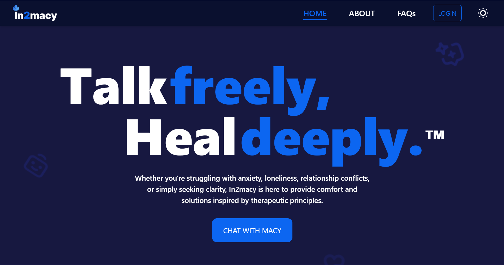

---

### **Project Submission Template**
Create an example project template file (`projects/example-project.md`):

```markdown
# Project Name: In2Macy

## Project Description
 In2macy is an AI-powered therapy and connection app designed to provide personalized
 emotional support and foster meaningful relationships. It offers a safe and private space for
 users to engage in guided therapy sessions with “Macy,” our intelligent chatbot, while also
 connecting with a community of like-minded individuals through interest and mental wellness
 matches.

## Features
-  AI-Guided Therapy Sessions:
 Users can interact with Macy for on-demand support, completing personalized emotional
 exercises and guided conversations.
-  Community Connections:
 In2macy matches users with individuals who share similar interests and emotional
 profiles, enabling authentic peer support.
-  Gamified Healing:
 Earn tokens after therapy sessions, streaks, and milestones, making emotional wellness
 rewarding and engaging.
-  Secure Mental Profiles:
 Privacy-first technology ensures that users’ sensitive information is protected.
-  Global Inclusivity:
 Cross-border features make emotional support accessible worldwide, breaking down
 barriers to mental wellness.

## Tech Stack
- **Blockchain:** [CrossFi]
- **Backend:** [Hardhat/Node.js]
- **Frontend:** [React/TailwindCSS]

## Screenshots/Demo


## Team
- [Name](Link to Profile)
- [Name](Link to Profile)

## Links
- [https://github.com/ECLA2025/in2macy](#)
- [https://crossfi-test.dex.guru/address/0x69cba83db2a2a7909dfe86890e1009dd587d7803](#)
- [https://in2macy-landing.onrender.com/](#)
- [Documentation](#)
